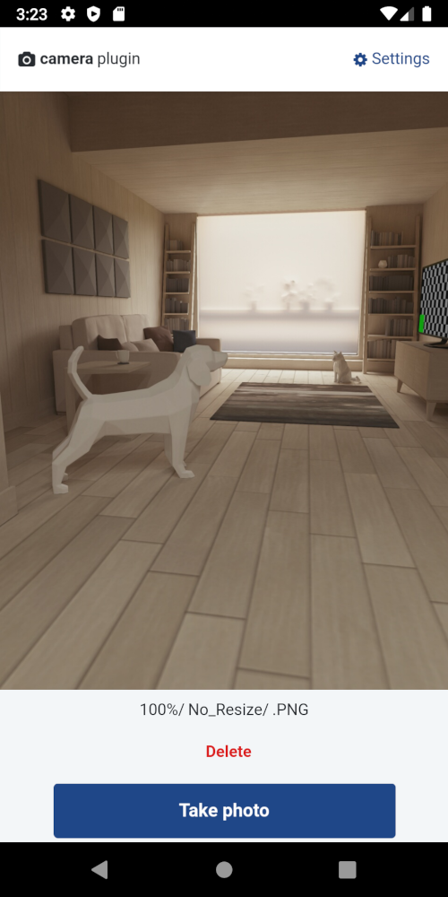

------------------------
DELETE THIS SECTION

**Template for mobile plugins**

Use this document template as a guide to create content. Focus on what developers want to achieve with this plugin. See a full example for [Camera Plugin](https://github.com/OutSystems/docs-product/blob/master/src/extensibility-and-integration/mobile-plugins/camera/intro.md).

Below is a list of the type of content you can create:

* **Concept**, to explain what something is. See [TK Template for a Concept](../concept.md). For all developers.
* **Process**, to explain in an overview or introduction how to do something. See [this example](https://github.com/OutSystems/docs-product/blob/master/src/extensibility-and-integration/mobile-plugins/camera/intro.md#creating-logic-to-take-a-picture). For proficient developers.
* **Procedure**, to explain how to do something in detail (step-by-step). See [TK Template for a Procedure](../procedure.md). For new developers.
* **Reference**. to explain in detail how the options work, this information is usually shown in a table format. For proficient developers.

Replace the following list of placeholders with the correct terms.

* PLUGIN_NAME - the name of the plugin
* PLUGIN_NAME sample app - the name of the sample app for this plugin

After you add content, delete all:

* Template instructions in parenthesis `()` 
* HTML comments with instructions `<!-- -->`
* Text in *italic*, as it's part of the instructions on how to write a document
* Content in this section :) 

------------------------

# PLUGIN_NAME

Use the *PLUGIN_NAME* to let users ______________. This plugin works with native mobile apps and lets you select options like ______________. (See [TK Template for a Concept](../concept.md) for more instructions how to write an introduction.) 

<!--

For publishing in the official OutSystems docs repo, use the link [Adding plugins](../intro.md#adding-plugins)

The full link is https://success.outsystems.com/Documentation/11/Extensibility_and_Integration/Mobile_Plugins#adding-plugins

-->

See [Adding plugins](../intro.md#adding-plugins) to learn how to install and reference a plugin in your OutSystems apps, and how to install a sample app.

 

## Sample app

Install *PLUGIN_NAME sample app* from Forge and open the app in Service Studio. The sample app contains logic for common use cases, which you can examine and recreate in your apps. For example, the sample app shows how to:

* Use case 1
* Use case 2
* Use case 3
* ...

<!-- a screenshot from the sample app --> 

## Creating user interface

## Creating logic to do SOME_ACTION 1

## Notes about PLUGIN_FEATURE

When you set _________ users might notice _________

When setting _________, consider the use case for your app. Check out the following table.

| Example use case | Parameter settings | Notes |
| ---------------- | ------------------ | ----- |
| Use case 1       | VALUE1             |       |
| Use case 2       | VALUE1             |       |
| Use case 3       | VALUE1             |       |

## Handling errors / Ensuring excellent user experience

<!-- plugin-specific information about handling errors or
    or ensuring UX in use cases --> 

## Reference

More information about the plugin.

### Action

Here is the reference of the actions you can use from the plugin. PLUGIN_NAM uses a Cordova plugin, and for more information check [cordova-PLUGIN_NAME](https://github.com/OutSystems/cordova-PLUGIN_NAME).

| Action           | Description     |
| ---------------- | --------------- |
| **ACTION_NAME1** | (description)  |
| **ACTION_NAME2** | (description)  |
| **ACTION_NAME3** | (description)* |

(*) Additional comments about **ACTION_NAME3**.

## Known issues and workarounds

A list of known issues and possible workarounds.

### Know issue 1 

<!-- delete the extra Applies to lines so you have one "Applies to" --->

**Applies to native apps and PWAs.**

**Applies to native apps.**

**Applies to iOS only.**

**Applies to Android only.**

**Applies to PWAs.**

**Issue description**

*From a user and developer perspective, what's happening and shouldn't happen as it's not an expected behavior.*

**Rationale**

*What's the cause of the issue*

**Workaround** 
 
*Suggestions to stop the issue from manifesting.*
