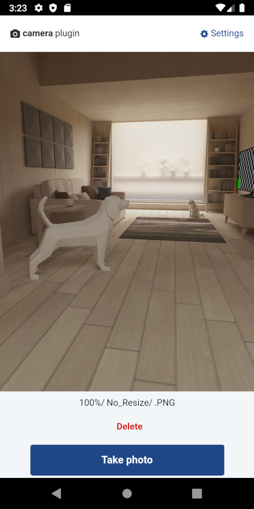

------------------------
DELETE THIS SECTION

**Template for mobile plugins**

See a full example for [Camera Plugin](https://github.com/OutSystems/docs-product/blob/master/src/extensibility-and-integration/mobile-plugins/camera/intro.md).

Here is the list of placeholders:

* PLUGIN_NAME - the name of the plugin
* PLUGIN_NAME sample app - the sample app of the plugin

------------------------

# PLUGIN_NAME

Use the *PLUGIN_NAME* to let users ______________. This plugin works with native mobile apps and lets you select options like ______________.

<!--

For publishing in the official OutSystems docs repo, use the link [Adding plugins](../intro.md#adding-plugins)

The full lik is https://success.outsystems.com/Documentation/11/Extensibility_and_Integration/Mobile_Plugins#adding-plugins

-->

See [Adding plugins](../intro.md#adding-plugins) to learn how to install and reference a plugin in your OutSystems apps, and how to install a sample app.

 

## Sample app

Install *PLUGIN_NAME sample app* from Forge and open the app in Service Studio. The sample app contains logic for common use cases, which you can examine and recreate in your apps. For example, the sample app shows how to:

* Use case 1
* Use case 2
* Use case 3
* ...

<!-- a screenshot from the sample app --> 

